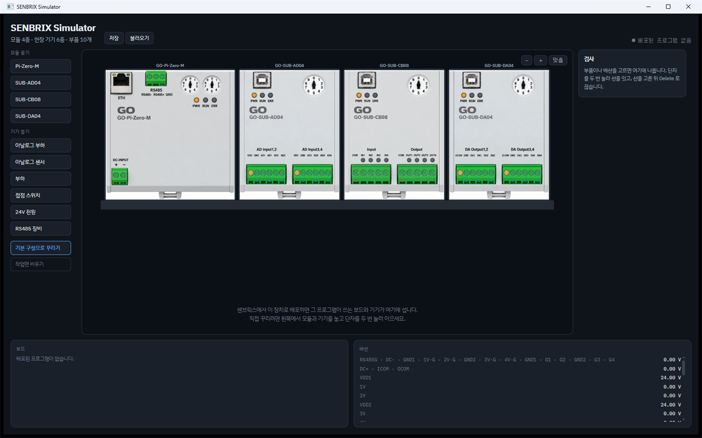

<p align="right"><b>한국어</b> | <a href="README.en.md">English</a></p>
<p align="center">
  
</p>
<h1 align="center">Senbrix PLC</h1>
<p align="center">라즈베리파이를 <b>PLC처럼</b> 쓰게 해주는 래더 + C# 개발 환경</p>
<p align="center">
  <a href="https://github.com/going-kr/Release.Senbrix/releases/latest"><b>⬇ Senbrix-win-Setup.exe 내려받기</b></a>
  &nbsp;·&nbsp; Windows 10/11 x64 &nbsp;·&nbsp; 한국어 / English UI
</p>

---

이 저장소는 에디터 설치 파일, 자동 업데이트 산출물, 그리고 라즈베리파이 런타임 패키지와 설치 스크립트만 배포합니다. 소스 코드는 비공개로 관리하고 있습니다.

> ℹ️ 릴리스 페이지 하단의 "Source code (zip / tar.gz)"는 GitHub가 모든 릴리스에 자동으로 붙이는 링크로, 이 배포 저장소(README, 이미지, 설치 스크립트)의 스냅샷입니다. Senbrix 소스 코드가 아닙니다.

## Senbrix는 무엇인가

Senbrix는 [Going](https://github.com/going-kr)에서 만드는 라즈베리파이 PLC 개발 도구입니다. 래더(LD)와 C#을 한 프로그램으로 다루는 것이 특징인데, 래더로 짠 로직과 손으로 쓴 C#이 하나의 `partial class App` 안에서 심볼과 IntelliSense를 공유합니다. 빌드 결과는 라즈베리파이에서 도는 Senbrix 런타임(10ms 스캔 사이클)에 네트워크로 배포하고, 같은 연결로 실시간 모니터링과 진단도 합니다.

<p align="center"></p>

## 구성품: 에디터 + 런타임 (+ 시뮬레이터)

Senbrix는 에디터와 런타임으로 나뉘고, 설치와 릴리스도 따로 합니다. 하드웨어 없이 시험해 보고 싶을 때 쓰는 시뮬레이터가 하나 더 있습니다. 그래서 이 저장소의 릴리스 페이지에는 세 종류가 올라옵니다.

- `vX.Y.Z` — 에디터. Windows Setup과 자동 업데이트 자산이 들어 있고, "최신 릴리스"(latest)는 항상 에디터입니다.
- `runtime-vX.Y.Z` — 라즈베리파이 런타임(`Senbrix-runtime-X.Y.Z-linux.tar.gz`). 설치 스크립트 `install-runtime.sh`는 저장소 루트에 있어서 원라이너 URL이 바뀌지 않습니다.
- `sim-vX.Y.Z` — 시뮬레이터(`Senbrix-sim-X.Y.Z-win.zip`). 설치 없이 압축만 풀면 됩니다. 버전은 에디터·런타임과 따로 매기고, 릴리스 노트에 어느 런타임을 품고 있는지 밝힙니다.

| 구성 | 실행 위치 | 역할 |
|---|---|---|
| **Senbrix 에디터** (`vX.Y.Z` 릴리스) | Windows PC | 래더·심볼·C# 편집, 린트, 빌드(`dotnet build`), 런타임 발견·배포, 실시간 모니터링·진단, MCP 서버 |
| **Senbrix 런타임** (`runtime-vX.Y.Z` 릴리스) | Raspberry Pi | 배포된 앱을 10ms 스캔 사이클로 실행. HTTP(5557)·TextComm(5555)·mDNS로 에디터와 통신. systemd 서비스로 상주하면서 유지(keep) 메모리 저장·복원, IO 확장 보드(CAN)·메인 보드 GPIO·Modbus 통신을 구동 |
| **Senbrix 시뮬레이터** (`sim-vX.Y.Z` 릴리스) | Windows PC | 라즈베리파이 대신 배포를 받아 앱을 실행하고, 모듈과 현장 기기를 화면에서 결선하게 해 줍니다. 에디터에는 하나의 장치로 보입니다 |

런타임 설치 방법은 아래 [런타임 설치 (Raspberry Pi)](#런타임-설치-raspberry-pi) 절에 있습니다. 참고로 에디터의 "배포"는 런타임에 앱(빌드 결과)을 밀어넣는 것이지 런타임 자체를 설치하는 것이 아닙니다.

## 주요 기능

### 래더 편집기
접점, 코일, 펑션(TON/TOFF/TMON/TAON/CTU/CTD/CTR/SETOUT/RSTOUT/MCS/DIST/UNIT/WXCHG 등), 병렬 분기, 에지 검출을 키보드와 마우스로 배치합니다. P0, M10, D127 같은 주소 대신 심볼 이름으로 작성할 수 있고, 저장할 때마다 정적 린트가 돌면서 이중 코일, 끊긴 렁, 해제되지 않는 래치, 리셋 없는 카운터, 미정의 이름, 읽기만 하고 어디서도 쓰지 않는 심볼, 쓰기 전 읽기, 지나치게 복잡한 렁 같은 문제를 찾아냅니다.

### 심볼 테이블
이름과 주소의 매핑에 설명, 단위, 접근권한을 붙여서 관리합니다. 심볼을 유지(keep)로 지정하면 런타임이 값을 저장했다가 재부팅 후에 복원합니다.

<p align="center"></p>

### C# 코드
`Setup()`과 `Loop()`에 C#을 쓰면 래더와 같은 메모리(P·M·T·C·D·WP·WM)와 심볼을 그대로 쓸 수 있습니다. 사용자 C#은 래더 스캔과 분리된 태스크에서 돌기 때문에 10ms 사이클의 결정성을 해치지 않습니다. PID와 오토튜너, 필터, 유량 계량, FFT 같은 순수 제어/신호/계량 라이브러리가 기본 참조로 들어 있습니다.

<p align="center"></p>

### 빌드와 배포
빌드할 때마다 래더와 심볼에서 C# 소스를 다시 생성하고 `dotnet build`로 컴파일합니다. 결과물은 평범한 .NET 프로젝트입니다. 컴파일 에러가 나면 해당하는 래더 셀 위치를 되짚어서 알려줍니다. 빌드 결과는 mDNS로 발견한 라즈베리파이 런타임에 클릭 한 번으로 배포되고 바로 실행됩니다.

### 실시간 모니터링과 진단
접점·코일·타이머·워드 값을 래더 위에 실시간으로 표시합니다. 진단 모드에서는 미리 허가한 주소에 한해 값을 강제(force)하거나 쓸 수 있고, 허가하지 않은 주소는 런타임이 거부합니다(fail-closed). 연결이 끊기면 진단은 자동으로 해제됩니다.

<p align="center"></p>
<p align="center"></p>

### 하드웨어
캐리어 보드의 GPIO는 XML로 정의해서 IN/OUT 슬롯에 매핑하고, CAN 버스의 IO 확장 보드(IO-8)는 번호를 지정해서 붙입니다. ZPi-IO8R 캐리어 보드(Pi Zero 2 W, 포토커플러 입력 4점·릴레이 출력 4점) 정의는 기본으로 제공되어 선택 목록에서 바로 지정할 수 있습니다. 이렇게 만든 보드 구성은 프로젝트에 저장되고, 런타임이 그 구성을 그대로 읽어서 씁니다.

<p align="center"></p>

### 통신: Modbus RTU/TCP
슬레이브로 쓰면 PLC 메모리가 그대로 노출되고, 마스터로 쓰면 모니터(폴링 블록)와 바인드(원격↔로컬 매핑) 표를 통해 상대 장비를 읽고 씁니다. 통신 설정 UI는 각 플러그인이 선언한 속성에서 자동으로 만들어집니다.

<p align="center"></p>

### AI 워크플로우 (MCP)
Senbrix에는 MCP 서버가 내장되어 있어서, Claude Code나 Codex 같은 AI 코딩 도구가 래더·심볼·통신·보드 구성을 도구 호출로 읽고 쓰고 빌드와 배포까지 할 수 있습니다. 인터뷰, 설계, 계획, 구현, 검증으로 이어지는 진행 단계와 산출물은 AI 페이지에서 확인합니다. 진단 모드에서는 AI도 허가된 범위 안에서만 런타임 값을 읽고 실험합니다.

<p align="center"></p>

### 시뮬레이터 (하드웨어 없이 시험하기)

라즈베리파이와 IO 모듈이 없어도 배포한 프로그램을 돌려 볼 수 있습니다. 시뮬레이터는 **런타임을 그대로 안에 넣고** 실행하므로, 스캔 사이클도 보드 드라이버도 실물과 같은 것이 돕니다. 다른 점은 보드와 주고받는 통로(실물에서는 CAN 선)뿐입니다.

에디터의 장치 연결 목록에 평범한 장치 하나로 뜨고, 평소처럼 배포하면 됩니다. 배포하고 나면 방금 배포한 프로그램이 쓰는 모듈이 화면의 레일에 붙고, 채널마다 스위치·센서·표시등이 놓이고 배선까지 이어집니다. 심볼에 적어 둔 이름이 그대로 기기 이름표가 되고, 단위도 따라옵니다.

- 스위치를 켜고 센서 값을 돌리면 프로그램이 반응합니다. 실행 중에도 값을 바꿀 수 있습니다
- 모듈과 기기를 직접 놓고 단자를 눌러 이을 수도 있습니다. 이을 수 없는 조합은 거절합니다
- 전원·접지·COM 은 선을 긋지 않아도 이어진 것으로 봅니다. 어느 공통에 물릴지는 단자마다 고를 수 있습니다
- 보드가 주고받는 값과 배선에 실린 값을 한 화면에서 봅니다

설치는 없습니다. `Senbrix-sim-X.Y.Z-win.zip` 을 풀고 `SenbrixSim.exe` 를 실행하면 됩니다(.NET 설치 불필요). 에디터와 같은 PC에서 써도 되고, 같은 네트워크의 다른 PC에서 써도 됩니다.

시뮬레이터는 런타임을 다시 만든 것이 아니라 **그 버전의 런타임을 그대로 품고** 있습니다. 그래서 릴리스마다 어느 런타임이 들어 있는지 밝히고(예: 시뮬레이터 `0.1.0` — 런타임 `0.9.2`), 압축을 풀면 `읽어보세요.txt` 첫 줄에도 적혀 있습니다. 라즈베리파이와 마찬가지로 **에디터가 품은 런타임보다 새 버전이면 배포가 거부됩니다.**

<p align="center"></p>

## 요구 사항

| 구분 | 요구 사항 |
|---|---|
| 에디터 PC | Windows 10/11 x64. [.NET 9 SDK](https://dotnet.microsoft.com/download/dotnet/9.0)를 직접 설치해야 합니다. 빌드가 `dotnet build`를 부르는데, 설치기는 데스크톱 런타임만 자동 설치하기 때문입니다 |
| 런타임 장비 | Raspberry Pi + Raspberry Pi OS 64bit(검증됨. 32bit는 미검증). .NET 9는 런타임 설치 스크립트가 함께 설치합니다. 에디터와 같은 네트워크(포트 5557/5555, mDNS)에 있어야 합니다 |
| 시뮬레이터 | Windows 10/11 x64. 별도 설치 없이 실행됩니다(.NET 포함). 런타임과 같은 포트(5557/5555, mDNS)를 씁니다 |

## 에디터 설치 (Windows)

1. [최신 릴리스](https://github.com/going-kr/Release.Senbrix/releases/latest)에서 `Senbrix-win-Setup.exe`를 내려받아 실행합니다.
2. 설치기가 서명되어 있지 않아서 Windows SmartScreen 경고가 뜰 수 있습니다. "추가 정보"를 누른 뒤 "실행"을 선택하면 됩니다.
3. .NET 9 데스크톱 런타임이 없으면 설치기가 알아서 내려받아 설치합니다. 이때 관리자 확인 창이 한 번 뜰 수 있습니다.
4. 설치 위치는 사용자 계정 아래(`%LocalAppData%\Senbrix`)라서 관리자 권한이 필요 없습니다.
5. .NET 9 SDK가 없다면 [여기](https://dotnet.microsoft.com/download/dotnet/9.0)서 SDK(x64)를 설치합니다. 빌드가 `dotnet build`를 실행하기 때문에 SDK가 없으면 Build가 실패합니다(편집과 저장은 됩니다). `dotnet --list-sdks`로 설치를 확인할 수 있습니다.

## 런타임 설치 (Raspberry Pi)

에디터가 배포할 대상인 Senbrix 런타임을 라즈베리파이에 한 번 설치합니다. Raspberry Pi OS(64bit 검증됨, 32bit는 미검증) 셸에서 한 줄이면 됩니다.

```bash
curl -sSL https://raw.githubusercontent.com/going-kr/Release.Senbrix/master/install-runtime.sh | sudo bash
```

스크립트가 하는 일:
1. .NET 9 ASP.NET Core 런타임을 `/opt/dotnet`에 설치합니다(공식 `dotnet-install.sh` 사용, arm64/arm32 자동 판별, 이미 있으면 건너뜀).
2. 런타임 릴리스(태그 `runtime-vX.Y.Z`, 에디터 릴리스 `vX.Y.Z`와는 별개)에서 `Senbrix-runtime-x.y.z-linux.tar.gz`를 받아 `/opt/senbrix`에 설치합니다. 재설치나 업데이트 때 `Apps/`, `Logs/`, `appsettings.json`은 보존됩니다.
3. CAN IO 확장 보드 사용 여부를 묻습니다. 사용하면 인터페이스명(예: `can0`)을 입력하고, 사용하지 않으면 그냥 엔터를 누릅니다(재설치 때는 엔터가 기존 설정 유지).
4. 전용 사용자 `senbrix`(gpio·dialout 그룹)를 만들고, systemd 서비스 `senbrix-runtime`을 등록·기동한 뒤 상태와 IP를 출력합니다.

옵션: `sudo bash -s -- --version 0.9.0`(버전 고정, 에디터와 같은 버전 권장) · `--tarball ./파일.tar.gz`(오프라인, 미리 받은 파일 사용) · `--can-port <이름|none>`(CAN 질문 생략) · `--no-dotnet`(.NET 설치 생략).
업데이트도 같은 명령을 다시 실행하면 됩니다. 되돌리려면: `sudo systemctl disable --now senbrix-runtime && sudo rm -rf /opt/senbrix /etc/systemd/system/senbrix-runtime.service`

설치 후에는:
- 네트워크: 에디터 PC와 같은 네트워크에 두고, 방화벽을 쓴다면 5557(HTTP), 5555(TextComm), 5353/UDP(mDNS)를 엽니다.
- 확인: 에디터 하단의 연결 아이콘 → 장치 연결 목록에 라즈베리파이 호스트명이 뜨면 성공입니다. 안 뜨면 IP를 직접 입력하세요. 이후 Deploy로 빌드 결과를 보내면 런타임이 앱을 받아서 즉시 실행합니다.
- 로그는 `journalctl -u senbrix-runtime -f`, 설정은 `/opt/senbrix/appsettings.json`에 있습니다. CAN IO 확장 보드용 `Runtime:CanPort`는 설치 때 질문으로 정해지고, 나중에 바꾸려면 이 파일을 고치고 서비스를 재시작합니다.
- 에디터가 런타임보다 새 버전이면 배포가 거부되고 상태바에 "런타임 업데이트가 필요합니다"가 뜹니다. 위 명령으로 런타임을 올리면 됩니다.
- 현재 런타임 API는 인증이 없습니다. 반드시 격리된 설비 네트워크에서만 운용하세요.

<details>
<summary>수동 설치(스크립트를 쓰지 않을 때)</summary>

```bash
# .NET 9 ASP.NET Core 런타임
curl -sSL https://dot.net/v1/dotnet-install.sh | sudo bash /dev/stdin --channel 9.0 --runtime aspnetcore --install-dir /opt/dotnet
sudo ln -sf /opt/dotnet/dotnet /usr/local/bin/dotnet
# 사용자·폴더·파일
sudo useradd --system --no-create-home senbrix
sudo mkdir -p /opt/senbrix && sudo tar -xzf Senbrix-runtime-x.y.z-linux.tar.gz -C /opt/senbrix
sudo chown -R senbrix:senbrix /opt/senbrix
```
`/etc/systemd/system/senbrix-runtime.service`:
```ini
[Unit]
Description=Senbrix Runtime (PLC)
Wants=network-online.target
After=network-online.target

[Service]
Type=notify
User=senbrix
WorkingDirectory=/opt/senbrix
Environment=DOTNET_ROOT=/opt/dotnet
ExecStart=/opt/dotnet/dotnet /opt/senbrix/Senbrix.Runtime.dll
Restart=always
RestartSec=5
SyslogIdentifier=senbrix-runtime

[Install]
WantedBy=multi-user.target
```
```bash
sudo systemctl daemon-reload && sudo systemctl enable --now senbrix-runtime
```
</details>

## 시뮬레이터 설치 (Windows)

설치기가 없습니다. 압축을 풀면 끝입니다.

1. 최신 시뮬레이터 릴리스(`sim-vX.Y.Z`)에서 **`Senbrix-sim-X.Y.Z-win.zip`** 을 받습니다.
2. 원하는 폴더에 풉니다. `Program Files` 처럼 쓰기 권한이 필요한 곳은 피하세요 — 프로그램이 자기 폴더 안에 `Apps/`·`Benches/`·`Logs/` 를 만듭니다.
3. **`SenbrixSim.exe`** 를 실행합니다. .NET 은 안에 들어 있어 따로 설치하지 않아도 됩니다.
4. 에디터의 장치 연결 창을 열면 목록에 뜹니다. 평소처럼 배포하면 됩니다.

| 항목 | 내용 |
|---|---|
| 요구 사항 | Windows 10/11 x64. 화면은 WebView2 로 그립니다 — 요즘 윈도우에는 대개 들어 있고, 없으면 "Microsoft Edge WebView2 Runtime" 을 받아 설치한 뒤 다시 실행하세요 |
| 네트워크 | 런타임과 같은 포트(5557 / 5555)와 mDNS 를 씁니다. 에디터와 같은 네트워크에 있어야 하고, 같은 PC 에서 라즈베리파이용 런타임과 동시에 띄우면 부딪힙니다 |
| SmartScreen | 실행 파일이 서명되어 있지 않아 경고가 뜰 수 있습니다 — "추가 정보 → 실행" |
| 설정 | `appsettings.json` 의 `DeviceName`(에디터에 보일 이름)·`HttpPort`·`CommPort`. **`DeviceName` 에 한글을 넣지 마세요** — mDNS 로 알리는 이름이라 에디터가 목록에서 찾지 못합니다. 고친 뒤에는 다시 실행하세요 |
| 지우기 | 푼 폴더를 지우면 끝입니다. 레지스트리에 아무것도 쓰지 않습니다 |

업데이트는 새 zip 을 받아 다시 푸는 것입니다. `Apps/`(배포된 프로그램)·`Benches/`(저장한 작업면)·`Devices/`(내가 넣은 장비 맵)·`appsettings.json` 을 남기고 싶다면 그 넷을 옮겨 두었다가 되돌려 놓으세요.

## 업데이트

- 에디터: 설치한 뒤에는 앱이 시작할 때 새 버전이 있는지 확인합니다. 도움말 › 업데이트 확인에서 내려받아 재시작하면 되고, 이 페이지에 다시 올 필요는 없습니다.
- 런타임: 라즈베리파이에서 [런타임 설치](#런타임-설치-raspberry-pi)의 원라이너를 다시 실행합니다(`Apps/`와 설정은 보존됩니다). 에디터가 런타임보다 새 버전이면 배포가 거부되니, 에디터를 올렸다면 런타임도 올려 주세요.
- 시뮬레이터: 새 zip 을 받아 다시 풉니다([시뮬레이터 설치](#시뮬레이터-설치-windows)). 자동 업데이트는 없습니다. 시뮬레이터가 품은 런타임 버전은 릴리스 노트에 적혀 있으니, 에디터를 올렸다면 그에 맞는 시뮬레이터도 받으세요.

## 릴리스 파일 안내

| 릴리스 | 파일 | 용도 |
|---|---|---|
| `vX.Y.Z` (에디터) | `Senbrix-win-Setup.exe` | **에디터를 처음 설치할 때 받는 파일** |
| `vX.Y.Z` (에디터) | `Senbrix-x.y.z-full.nupkg`, `*-delta.nupkg`, `RELEASES`, `releases.win.json`, `assets.win.json` | 자동 업데이트 패키지와 메타데이터. 직접 받을 일 없음 |
| `runtime-vX.Y.Z` (런타임) | `Senbrix-runtime-x.y.z-linux.tar.gz` | 라즈베리파이 런타임. `install-runtime.sh`가 직접 받으므로 보통 따로 받지 않음(오프라인 설치 시 `--tarball`) |
| `sim-vX.Y.Z` (시뮬레이터) | `Senbrix-sim-x.y.z-win.zip` | 하드웨어 없이 시험할 때. 압축을 풀고 `SenbrixSim.exe` 실행. 품고 있는 런타임 버전은 릴리스 노트와 `읽어보세요.txt` 에 있음 |
| 저장소 루트 | `install-runtime.sh` | 런타임 설치 스크립트 ([런타임 설치](#런타임-설치-raspberry-pi)) |
| (자동) | `Source code (zip)`, `Source code (tar.gz)` | GitHub가 자동으로 붙이는 이 배포 저장소의 스냅샷. Senbrix 소스 코드가 아니며 받을 필요 없음 |

## 문의

버그나 요청은 이 저장소의 [Issues](https://github.com/going-kr/Release.Senbrix/issues)에 남겨 주세요.

---

© Going. All rights reserved. 바이너리는 있는 그대로 제공됩니다. [NOTICE.md](NOTICE.md) 참고.
