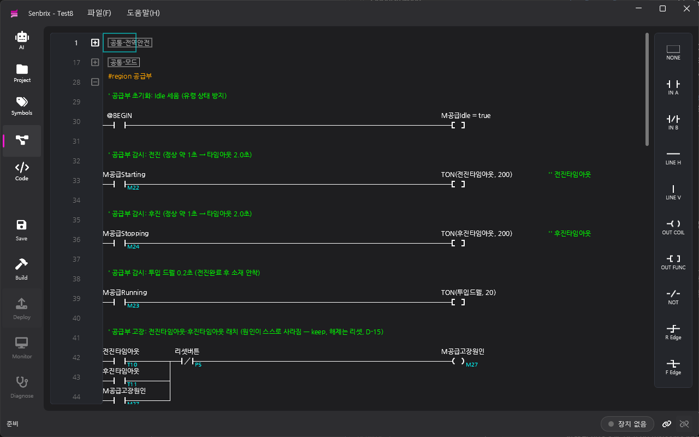
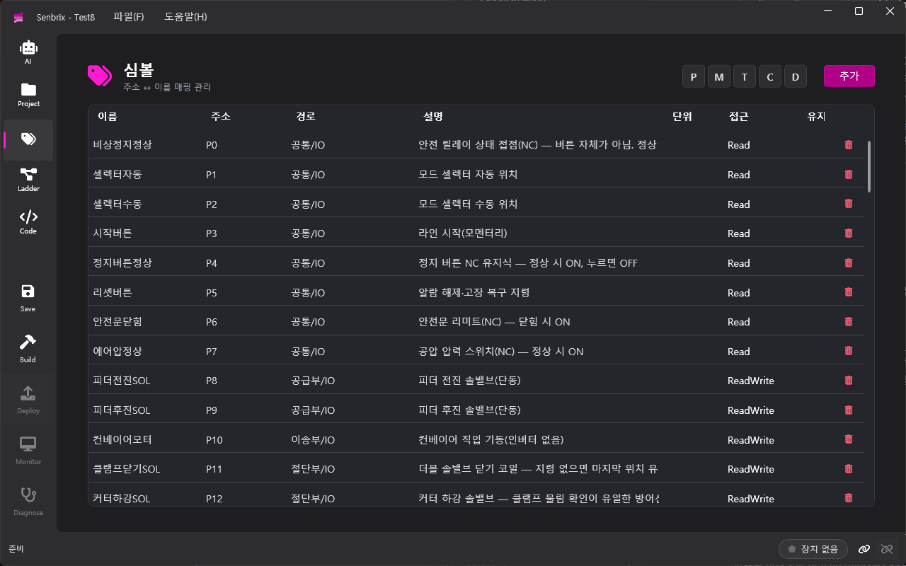
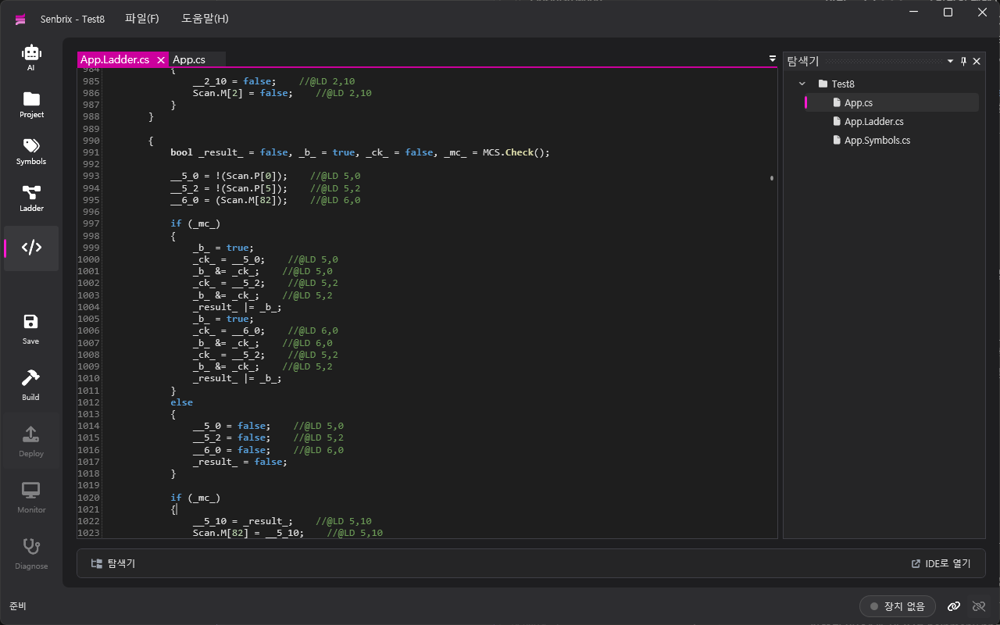
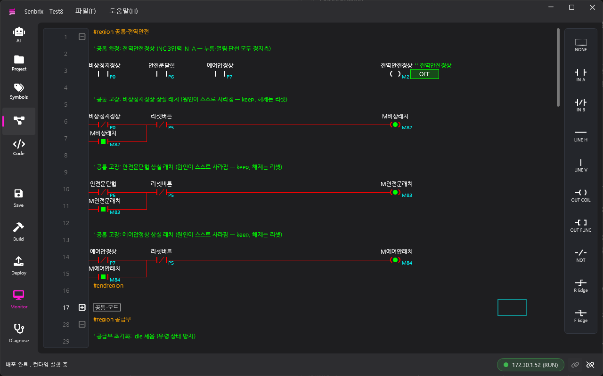
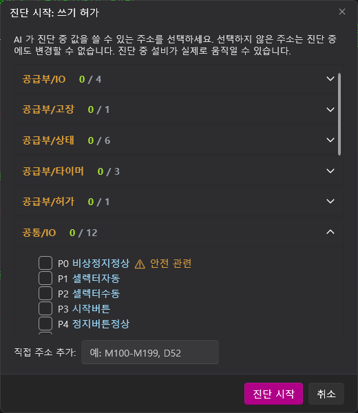
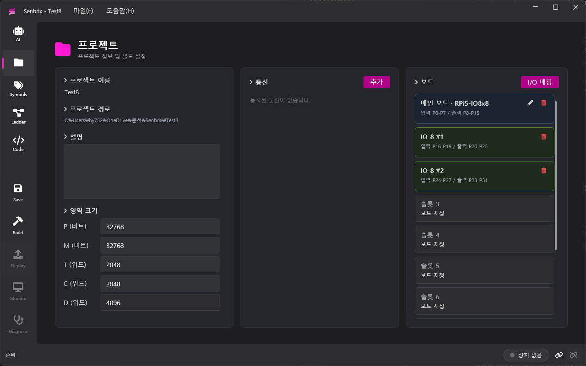
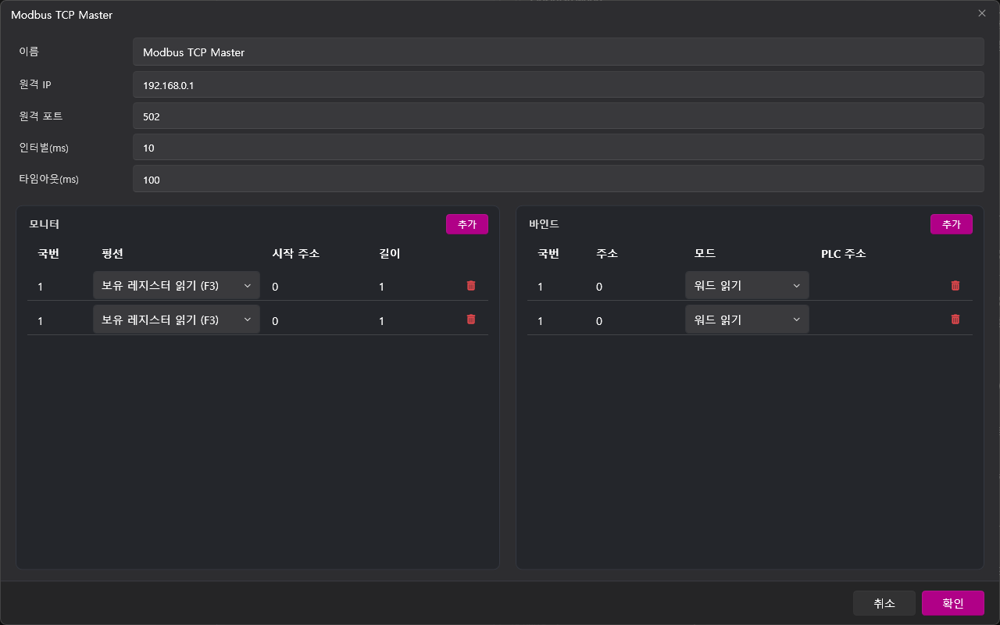
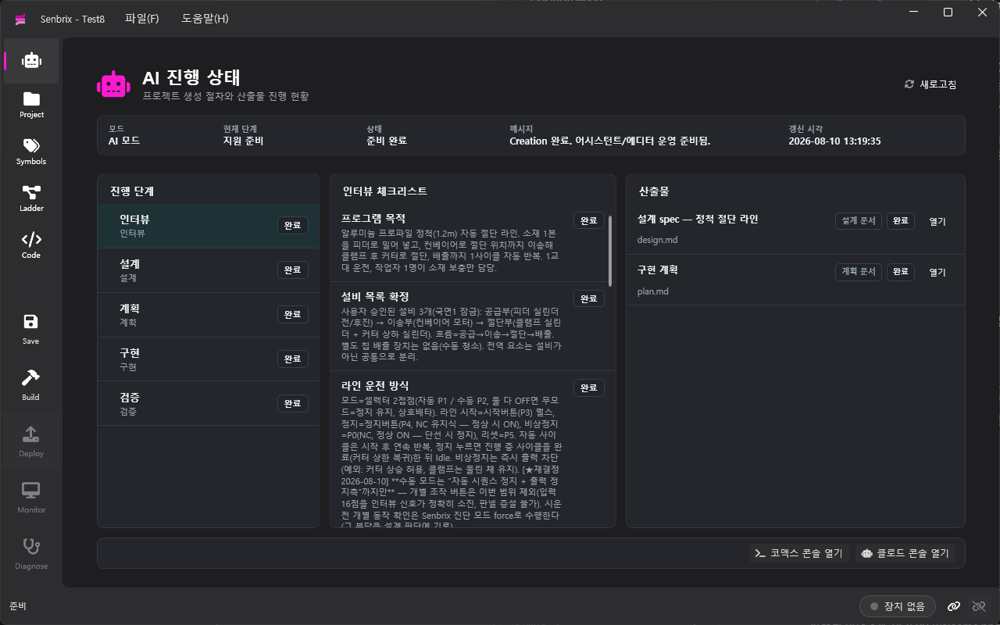

<b>한국어</b> | <a href="README.en.md">English</a>

  

<h1 align="center">Senbrix PLC</h1>

라즈베리파이를 <b>PLC 처럼</b> 쓰게 해 주는 래더 + C# 개발 환경

  <a href="https://github.com/going-kr/Release.Senbrix/releases/latest"><b>⬇ Senbrix-win-Setup.exe 내려받기</b></a>
  &nbsp;·&nbsp; Windows 10/11 x64 &nbsp;·&nbsp; 한국어 / English UI

---

이 저장소는 **설치 파일과 자동 업데이트 산출물만** 배포합니다. 소스 코드는 비공개로 관리됩니다.

## Senbrix 는 무엇인가

**Senbrix** 는 [Going](https://github.com/going-kr) 의 라즈베리파이 PLC 개발 도구입니다. **래더(LD)** 와 **C#** 을 한 프로그램으로 다룹니다. 래더로 짠 로직과 손으로 쓴 C# 이 같은 `partial class App`, 같은 심볼, 같은 IntelliSense 를 공유하고, 빌드 결과는 라즈베리파이 위의 **Senbrix 런타임**(10ms 스캔 사이클)에 네트워크로 배포됩니다. 같은 연결로 **실시간 모니터링과 진단**까지 수행합니다.

## 주요 기능

### 래더 편집기: 익숙한 문법, 심볼 기반
접점·코일·펑션(TON/TOFF/TMON/TAON/CTU/CTD/CTR/SETOUT/RSTOUT/MCS/DIST/UNIT/WXCHG…)·병렬 분기·에지 검출을 키보드와 마우스로 배치합니다. 주소(P0, M10, D127…) 대신 **심볼 이름**으로 작성하고, 저장 시 **정적 린트**가 이중 코일·끊긴 렁·래치 미해제·리셋 없는 카운터·미정의 이름·읽기 전용 심볼·쓰기 전 읽기 같은 문제를 잡아 줍니다.

### 심볼 테이블
이름 ↔ 주소 매핑, 설명·단위·접근권한, 그리고 **유지(keep) 심볼**. 체크 하나로 값이 런타임에 저장·복원되어 재부팅 뒤에도 이어집니다.

### C# 코드: 래더와 한 프로그램
`Setup()` / `Loop()` 에 C# 을 쓰면 래더와 같은 메모리(P·M·T·C·D·WP·WM)와 심볼을 그대로 씁니다. 사용자 C# 은 래더 스캔과 분리된 태스크에서 돌아 10ms 사이클의 결정성을 해치지 않습니다. 순수 제어/신호/계량 라이브러리(PID·오토튜너·필터·유량 계량·FFT)가 기본 참조로 들어 있습니다.

### 빌드 & 배포: 결과물이 그대로 .NET 프로젝트
래더·심볼에서 C# 소스를 매 빌드 재생성하고 `dotnet build` 로 컴파일합니다. 컴파일 에러는 **래더 셀 좌표로 역매핑**되어 표시됩니다. 빌드 결과는 mDNS 로 발견한 라즈베리파이 런타임에 한 번의 클릭으로 배포되고 자동 실행됩니다.

### 실시간 모니터링 & 진단
접점·코일·타이머·워드 값을 **래더 위에 실시간 표시**합니다. 진단 모드에서는 허가한 주소만 골라 값을 **강제(force)** 하거나 쓸 수 있고, 허가하지 않은 주소는 런타임이 거부합니다(fail-closed). 연결이 끊기면 진단은 자동으로 해제됩니다.

### 하드웨어: 메인 보드 GPIO + IO 확장 보드
캐리어 보드의 GPIO 는 XML 로 정의해 IN/OUT 슬롯으로 매핑하고, CAN 버스의 IO 확장 보드(IO-8)는 번호를 지정해 붙입니다. 보드 구성은 프로젝트에 저장되어 런타임이 그대로 읽습니다.

### 통신: Modbus RTU/TCP 슬레이브 · 마스터
슬레이브는 PLC 메모리를 그대로 노출하고, 마스터는 모니터(폴링 블록)·바인드(원격↔로컬 매핑) 표로 상대 장비를 읽고 씁니다. 통신 설정은 플러그인이 선언한 속성에서 자동으로 UI 가 만들어집니다.

### AI 워크플로우 (MCP)
Senbrix 는 **MCP 서버**를 내장해 Claude Code · Codex 같은 AI 코딩 도구가 래더·심볼·통신·보드를 도구 호출로 읽고 쓰고, 빌드·배포까지 수행합니다. 인터뷰 → 설계 → 계획 → 구현 → 검증 단계와 산출물 진행이 AI 페이지에 표시되고, 진단 모드에서는 AI 가 허가된 범위 안에서 런타임 값을 읽고 실험합니다.

## 요구 사항

| 구분 | 요구 사항 |
|---|---|
| 에디터 PC | Windows 10/11 x64. **.NET 9 SDK**(빌드에 `dotnet build` 사용). 데스크톱 런타임은 설치기가 없으면 자동 설치 |
| 런타임 장비 | Raspberry Pi(64bit Linux) + .NET 9 런타임 + Senbrix 런타임(별도 제공). 에디터와 같은 네트워크(포트 5557/5555, mDNS) |

## 설치

1. [최신 릴리스](https://github.com/going-kr/Release.Senbrix/releases/latest) 에서 **`Senbrix-win-Setup.exe`** 를 내려받아 실행합니다.
2. 설치기는 서명되어 있지 않아 Windows SmartScreen 경고가 뜰 수 있습니다 → **"추가 정보" → "실행"**.
3. .NET 9 데스크톱 런타임이 없으면 설치기가 자동으로 내려받아 설치합니다(관리자 확인 창이 한 번 뜰 수 있음).
4. 사용자 계정 아래(`%LocalAppData%\Senbrix`)에 설치되며 관리자 권한이 필요 없습니다.

## 업데이트

설치된 앱은 시작 시 새 버전을 조용히 확인하고, **도움말 › 업데이트 확인** 에서 내려받아 재시작합니다. 이 페이지에서 다시 내려받을 필요가 없습니다.

## 릴리스 파일 안내

| 파일 | 용도 |
|---|---|
| `Senbrix-win-Setup.exe` | **처음 설치 시 받는 파일** |
| `Senbrix-x.y.z-full.nupkg`, `*-delta.nupkg` | 자동 업데이트 패키지. 직접 받지 않음 |
| `RELEASES`, `releases.win.json`, `assets.win.json` | 자동 업데이트 메타데이터 |

## 문의

버그·요청은 이 저장소의 [Issues](https://github.com/going-kr/Release.Senbrix/issues) 에 남겨 주세요.

---

© Going. All rights reserved. 바이너리는 있는 그대로 제공됩니다. [NOTICE.md](NOTICE.md) 참고.
